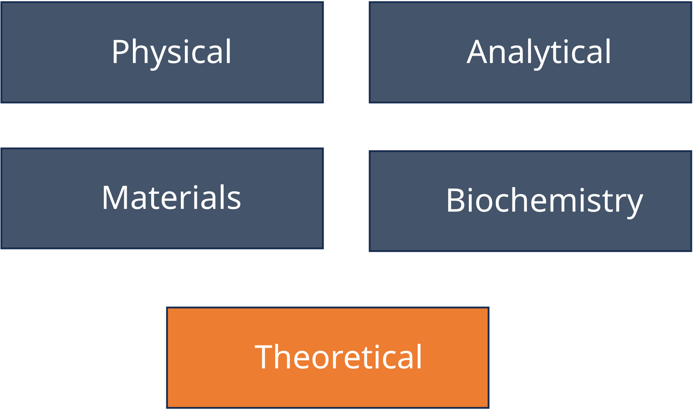
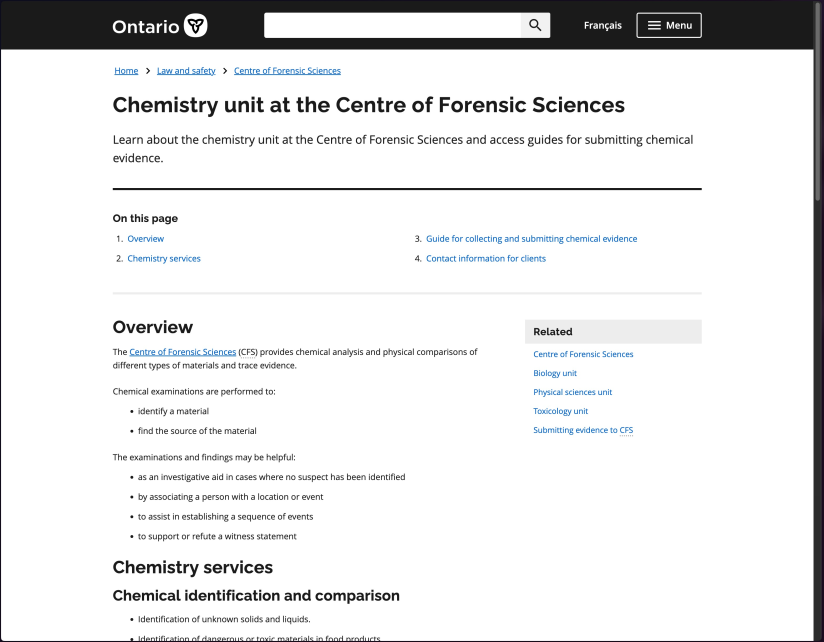
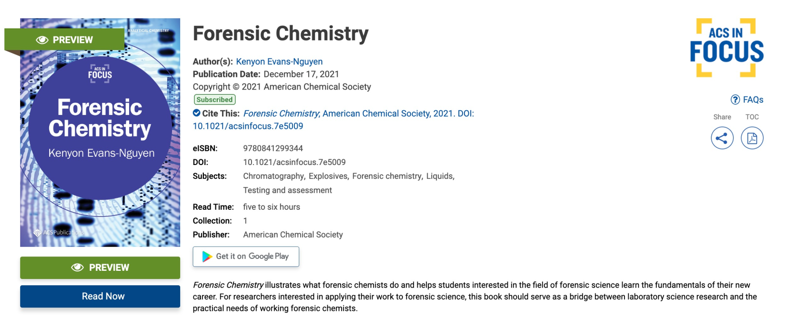

## Course Background
- FRSC 4730H is an **Advanced Topics Course** 
- Three primary areas of emphasis during lecture:
  - New(er) analytical chemistry techniques (week 4 + readings)
  - New(er) application areas (week 5 + readings)
  - Computational methods (weeks 3, 6, 9-12 ) 

- Secondary area of emphasis:
  - Life (weeks 7, 13, 14)
  
::: {.notes}

:::

## Instructor

- **Name:** Dr. Arun Moorthy
- **Position:** Assistant Professor, Forensic Science
- **Research Areas:** Applied Mathematics and Forensic Chemistry  
- **Office:** DNA B108.11
- **Office hours:** Tuesday 9 to 11 am
- **Email:** arunmoorthy@trentu.ca (usual respond within 48 hours)

## Course Structure

- **Lectures (schedule outlined in the syllabus):**
    - 25-40 minutes for a quick discussion about the lecture topic   

- **Seminars (schedule outlined in the syllabus):**
    - 110 minutes to work together (with me) on weekly assignments, major assignments, talk about lecture topic informally
  

## Note on live stream
- I will attempt to live stream all lectures through zoom, but technical difficulties are possible   
- Stream link is available in "Welcome Module" of course Blackboard

## Deliverables
- **Goals:** Learn/improve transferable and hirable skills in research, writing and computing; Build portfolio that demonstrates skill  
    - Reading Assignments (x5)
    - Programming Assignments (x2)
    - Major Assignments (x4)

## Reading Assignments (5)
- **GOAL**: Improve capacity in critical reading
- Each test has 19 questions evaluating your attention to detail, ability to think critically, *ability to think broadly*, and ability to communicate effectively
- Give yourself 1-2 hours per assignment (e.g., work on the assignment during seminar time)
- Discussion of these assignments leads directly to your Critical Review Article assignment
- Discussion of these assignments may help with constructing a research proposal

## Programming Assignments (2)
- **GOAL**: Improve your comfort/capabilities solving problems using the R programming language
- Each test has 10 questions chosen randomly from designed pools 
- You can try each assignment three times; we'll take your average score across all attempts as your grade
- Give yourself 2-3 hours per assignment (e.g., work on the assignments during a few seminar)
- These assignments may help with constructing a research proposal

## Methods Presentation
- **GOAL**: Demonstrate your ability to explain an analytical method; very common task for working forensic chemists
- You make work alone or in groups of at most 3 students
- Start as soon as possible and give yourself 8-12 hours to complete this assignment
- Submit a link to your recorded presentation via Blackboard by October 16th, 2026 at 11:59 PM. 
- Feedback from this presentation may help with constructing a research proposal

## Research Proposal Presentation
- **GOAL**:  Demonstrate your ability **to pitch** a potential research project through a short presentationl a very common task for working forensic chemists
- You may work alone or in groups of at most 4 students (can be same or different group from methods presentation)
- Start as soon as possible and give yourself 12-16 hours
- Submit a link to your recorded presentation via Blackboard by November 6th, 2026 at 11:59 PM.
- Feedback from this presentation may help with written research proposal

## Written Research Proposal 
- **GOAL**: Demonstrate your ability to create a formal research proposal; very common task for public sector scientist 
- You should work with the same group you've committed to with your proposal presentation
- Start as soon as possible and give yourself an additional 8-10 hours
- Submit your written proposal via Blackboard by November 27th, 2026 at 11:59 PM
- May help with graduate school applications

## Critical Review Article
- **GOAL**: Demonstrate your ability to critically evaluate a research article within context AND communicate your opinions to an audience
- **You must work independently**
- Give yourself an additional 6-10 hours (assuming you gave yourself 1-2 hours to read the article during the reading assignments)
- Submit your critical review article via Blackboard by December 3rd, 2026 at 11:59 PM
- May be a useful writing sample when apply to jobs

## Course Policy (1/3)
- **Attendance**: You are encouraged to attend lecture and seminar
  - you DO NOT need to contact us if you cannot attend

- **Due Dates**: All assignments are due as outlined in the syllabus.Assignments submitted after the due date will be penalized at a rate of 5% per 30 minutes that the assignment is late.

## Course Policy (2/3)
- **Uncontrollable Circumstances Exception**: If you are unable to submit one of your assignments due to something out of your control (e.g., sudden illness, accident), you can move up to 80% of the weight of your assignment to a future assignment in the same category (i.e., weekly or major)
  - you must submit your request as an email; no need to explain your circumstance
  - amount of weight that you move to a future assignment will drop 5% per half hour after the due date

## Course Policy (3/3)
- **Use of generative AI and other software tools**: In general, you may use generative AI tools (e.g., Microsoft Co-pilot) and other software tools to help you brainstorm ideas and learn concepts for assignments in this class. However, we have some specific requirements that you should adhere to: 

    1. All submitted work must be your own. I.e., Do not plagiarize.
    1. Any mistakes in your work due to use of generative AI or other software tools are YOUR responsibility and will be penalized accordingly. 
    1. DO NOT upload other peoples' work to a generative AI services; this is a breach of copyright. 

## {.center}

::: {.text-center}
A quick note on group work
:::

## {.center}

::: {.text-center}
A quick tour of blackboard
:::

## What is forensic chemistry?

:::: {.columns}

::: {.column width="60%" .nonincremental}
- Forensic chemistry is a phrase used to describe the application of chemistry to analyze evidence involved with suspected/potential criminal activity  
- The branch of chemistry *predominantly* associated with traditional forensic chmistry is analytical chemistry
:::
::: {.column width="10%"}
:::
::: {.column width="30%"}
  
{width="90%" fig-align="center"}
:::

::::

## Forensic Chemist vs. Analytical Chemist
- Exploratory vs. confirmatory
- Emphasis on quality control measures (in lab and reporting)
    - more restrictive SOPs and maintenance schedules
    - more substantial peer review of reports
- Testifying 
    - Results must be able to stand up to adversarial questioning
- Ethics and professionalism
- Resourcefulness

## A forensic chemist's *traditional* toolbox
- Elemental Analysis
    - ICP-MS, SEM-EDS  
- Molecular Analysis
    - Colour/Spot Test, GC-FID, HPLC, Capillary Electrophoresis, GC-MS, LC-MS, ATR-FTIR, Raman, XRD

::: {.notes}
- Choice of tool depends on several factors:
    - What are you analyzing? (solids vs liquids vs gas, mixtures vs pure compounds)
    - What do you need to know? (discriminating power, sensitvity)
    - Budget (purchase cost, maintenance cost, sample prep, cost-per-analysis)
    
    ICP-MS: Inductively coupled plasma mass spectrometry

SEM-EDS: Scanning electron microscopy - energy dispersive x-ray spectroscopy

Colour/Spot tests: assays

HPLC: High performance liquid chromatography

GC-MS: Gas chromatography mass spectrometry

ATR-FTIR : Attenuated Total Reflection Fourier Transform Infrared Spectroscopy

LC-MS: liquid chromatography mass spectrometry

Raman spectroscopyXRD: x-ray diffraction crystallography 

:::

## A forensic chemist's *traditional* problems
:::: {.columns}

::: {.column width="50%" .nonincremental}
- controlled substances
- ignitable liquids, fire debris analysis
- gun shot residue (GSR)
- explosives
- trace evidence (paint chips, glass, fibers, lubricants)

:::

::: {.column width="10%"}

:::

::: {.column width="40%"}
 
{width="90%" fig-align="center"}
:::
::::
[https://www.ontario.ca/page/chemistry-unit-centre-forensic-sciences](https://www.ontario.ca/page/chemistry-unit-centre-forensic-sciences){style="font-size: 0.3em;"}

## An excellent review of the field
{width="80%" fig-align="center"}
[https://pubs.acs.org/doi/book/10.1021/acsinfocus.7e5009](https://pubs.acs.org/doi/book/10.1021/acsinfocus.7e5009){style="font-size:0.3em;"}

## Coming up
- Seminars are running on Thursday September 17th (F01 and F02) 
 
- Lecture next week: On measurements