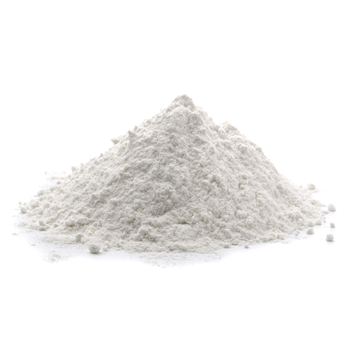
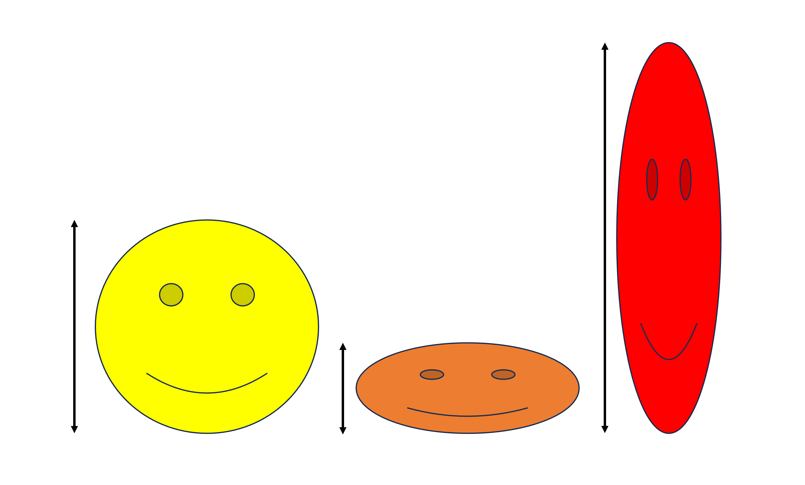
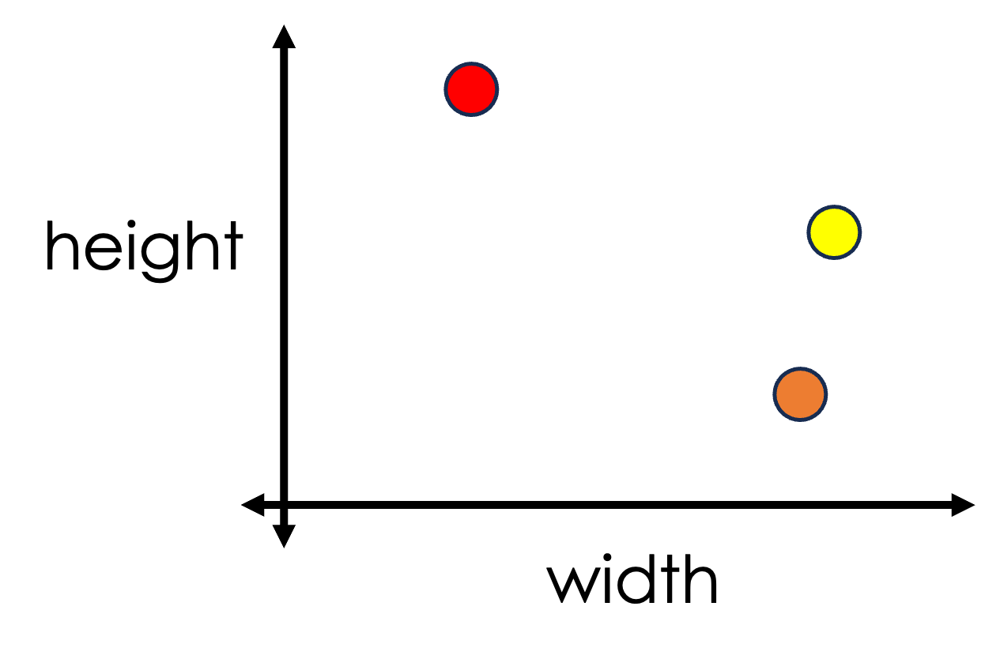
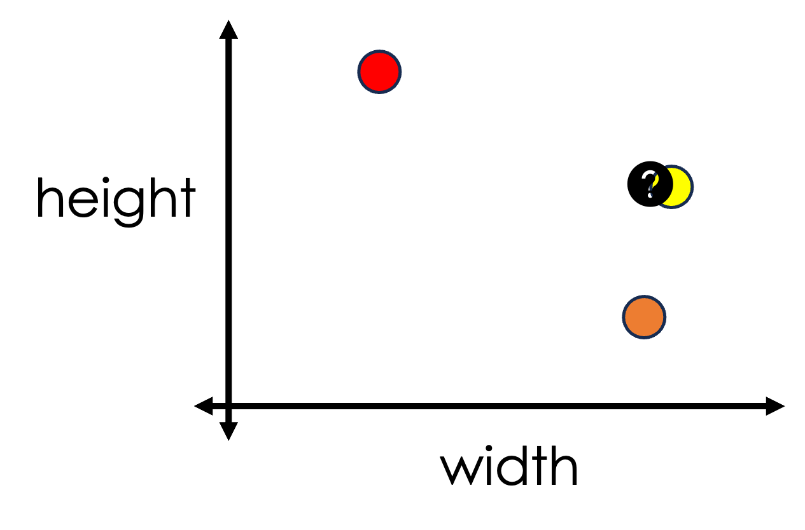
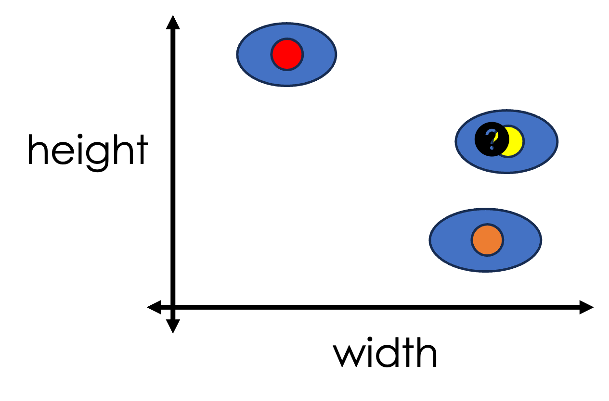
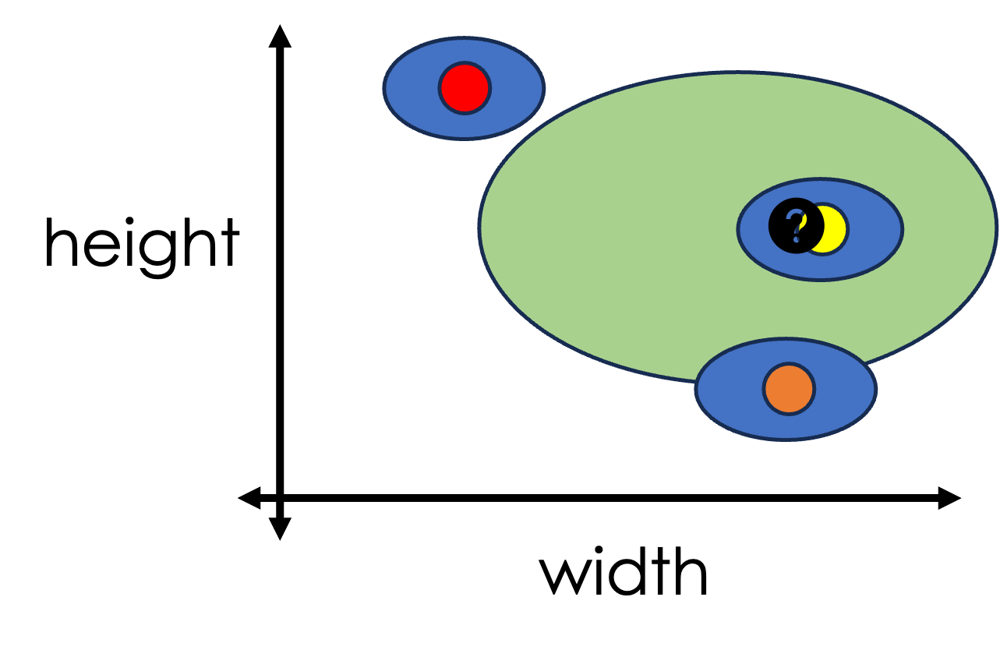
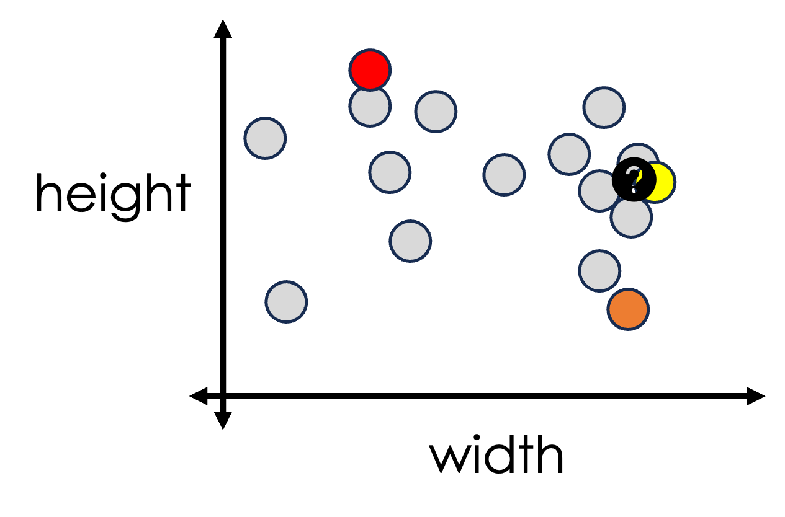

## What is a sample? 

:::: {.columns}

::: {.column width="60%"}
 
A **sample** is a physical material we are trying to identify (or classify or safely dispose of or otherwise deal with)

- [Usually a subset of a larger population]{style="font-size:85%"}
- [Insights from the sample may allow us to infer something about the population]{style="font-size:85%"}
    

:::

::: {.column width="40%"}
{fig-align="center"}
:::

::::

## What is a structure?

:::: {.columns}

::: {.column width="60%"}
 
A **structure** is a human-defined representation of the relationship between the atoms that constitute a compound

- [Names [**common** vs IUPAC]]{style="font-size:65%"}
- [Encodings [**SMILES** vs InChI vs InChIKey]]{style="font-size:65%"}   
- [Diagrams [Line drawings]]{style="font-size:65%"}   

[How materials are described; How materials are scheduled]{.fragment}
:::

::: {.column width="40%"}
{fig-align="center"}
:::

::::

## What is a measurement?

- A measurement is a quantity that characterizes some physical or phenomenological property of a sample
  
- In analytical (forensic) chemistry, a measurement is a *feature* that can be used to infer structure from a sample

## Example measurements

:::: {.columns}

::: {.column width="50%"}
Consider the shape to the right. 

:::

:::{.column width="50%"}
{fig-align="left"}
:::

::::

## Example measurements

:::: {.columns}

::: {.column width="50%"}
Consider the shape to the right. 

We can measure its height: 5 a.u.

:::

:::{.column width="50%"}
{fig-align="left"}
:::

::::

## Example measurements

:::: {.columns}

::: {.column width="50%"}
Consider the shape to the right. 

We can measure its height: 5 a.u.  

Consider these other two shapes.

We can measure their heights: 2 a.u. and 7 a.u.

:::

:::{.column width="50%"}
{fig-align="left"}
:::

::::

## Example measurements

:::: {.columns}

::: {.column width="50%"}
Consider the shape to the right. 

We can measure its height: 5 a.u.  

Consider these other two shapes.

We can measure their heights: 2 a.u. and 7 a.u.  

These would be considered scalar measurements.

:::

:::{.column width="50%"}
{fig-align="left"}
:::

::::

## Example measurements

:::: {.columns}

::: {.column width="50%"}
We can also measure their widths.   

:::

:::{.column width="50%"}
{fig-align="left"}
:::

::::

## Example measurements

:::: {.columns}

::: {.column width="50%"}
We can also measure their widths.   
These also would be considered scalar measurements.

:::

:::{.column width="50%"}
{fig-align="left"}
:::

::::

## Example measurements

:::: {.columns}

::: {.column width="50%"}
We can also measure their widths.   
These also would be considered scalar measurements.  
We can also think of these as "1-Dimensional" measurements
:::

:::{.column width="50%"}
{fig-align="left"}
:::

::::

## Example measurements

:::: {.columns}

::: {.column width="50%"}
We can also look at two measurements simultaneously.   
These are individual measurements of two properties.  
:::

:::{.column width="50%"}
{fig-align="left"}
:::

::::

## Example measurements

:::: {.columns}

::: {.column width="50%"}
Together, we can think of these as a "2-Dimensional" measurement; in some circles these might be called "signatures"
:::

:::{.column width="50%"}
{fig-align="left"}
:::

::::

## Scenario 1

:::: {.columns}

::: {.column width="50%"}
Imagine there was a crime committed, and we know two properties of the shape that committed the crime (shown as a question mark).  
What can we say?
:::

:::{.column width="50%"}
{fig-align="left"}
:::

::::

## Scenario 2

:::: {.columns}

::: {.column width="50%"}
What if we acknowledge the uncertainy (blue) that comes with measurements?  
What can we say?
:::

:::{.column width="50%"}
{fig-align="left"}
:::

::::

## Scenario 3

:::: {.columns}

::: {.column width="50%"}
What if the the measurements of the unknown are even more uncertain (green)?  
What can we say?
:::

:::{.column width="50%"}
{fig-align="left"}
:::

::::

## Scenario 4

:::: {.columns}

::: {.column width="50%"}
What if we acknowledge that there might be other shapes in the world for which we don't have measurements?  
What can we say?
:::

:::{.column width="50%"}
{fig-align="left"}
:::

::::

## Analytical Measurements

- Most analytical measurements look like ($x$,$y$)-data and can be thought of as $n$-dimensional; $x$ is the property, and $y$ is the measurement
    - Mass Spectrometry (abundance of ions with mass-to-charge ratio)
    - IR (percent transmittance at wave number)  
    
- We want to use analytical chemistry measurements to make decisions

## Analytical Measurements

- Analytical measurements in forensic chemistry are subject to same issues as all measurements
    - uncertainty in the reference measurements
    - poor quality of the analyte
    - "unknowability" in the search space  

- And other specific issues
    - phenomenological measurements
    - chemistry
    
## What is chemometrics

- Chemometrics is the application of mathematics and statistics (and computing) to chemical measurements
    - Week 6: Introduction/Refresher on programming with R
    - Week 9: Calculating similarities and differences 
    - Week 10: Projections and dimensionality reductions
    - Week 12: A numerical exploration of chemical space   

- Cheminformatics is the application of mathetics and statistics (and computing) to chemical information on week 11 and 13

## Coming up
- Seminars are running virtually (zoom) on Thursday September 24th (F01 and F02) 
 
- Lecture next week: Emerging analytical techniques in forensic chemistry