## Why develop new techniques?

- improve sensitivity 
  - extract **more** information from sample
  - extract information from **less** sample  
  
- improve specificity
  - extract more useful information from sample   
  
- improve speed 

- improve portability 

- improve costs 

::: {.notes}
 - speed could mean sample prep, acquisition and analysis
 - portability could mean taking things on the road, moving things between labs, etc.
 - costs could mean initial investment or operating costs or training costs
:::

## Ambient ionization mass spectrometry

 
[**HISTORY**]{.fragment}

- Techniques were first reported in the literature in 2004
  - Desorpition electrospray ionization (DESI)
  - Direct Analysis in Real Time (DART)   

- Developed as an alternative to standard mass spectrometry which required (1) ionization take place in a vacuum system, and (2) extensive sample preparation  
- Significantly faster method of generating mass spectra

##

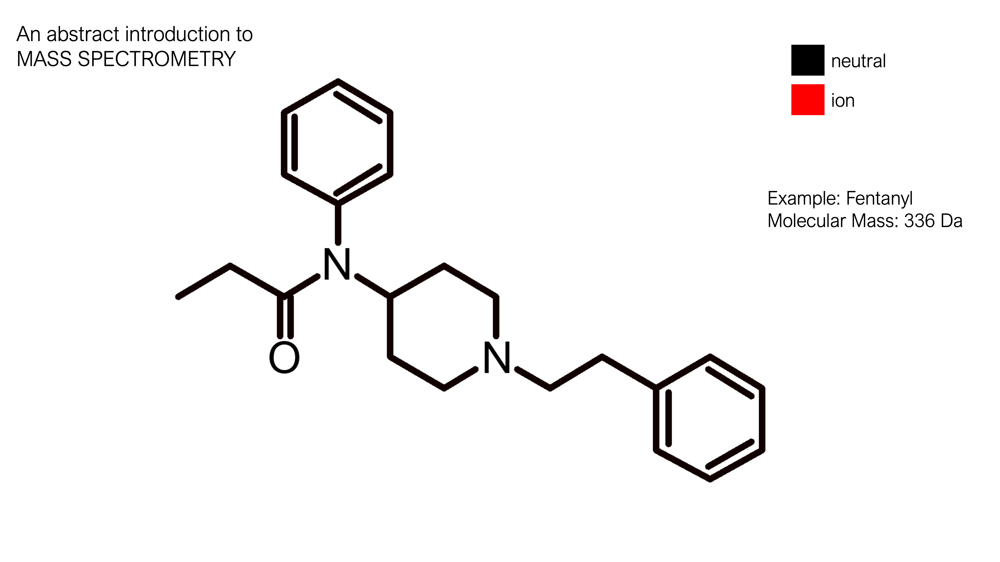{fig-align="center"}

##

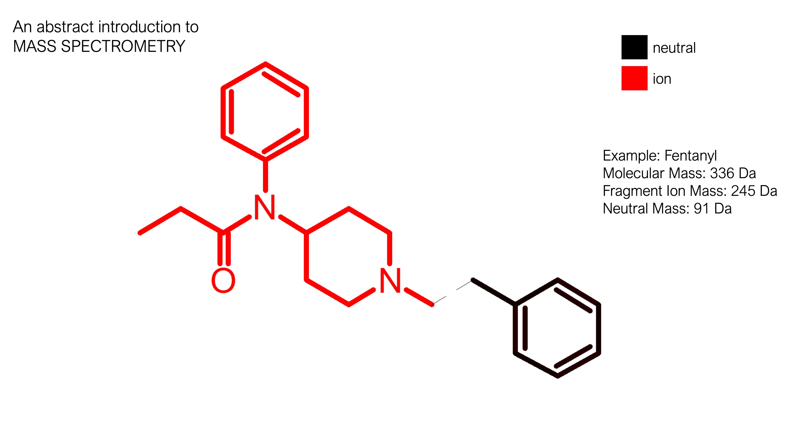{fig-align="center"}

##

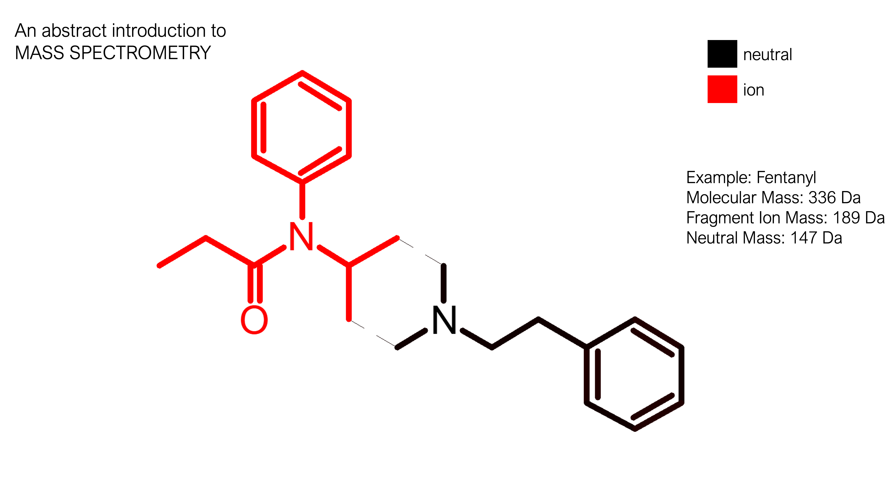{fig-align="center"}

##

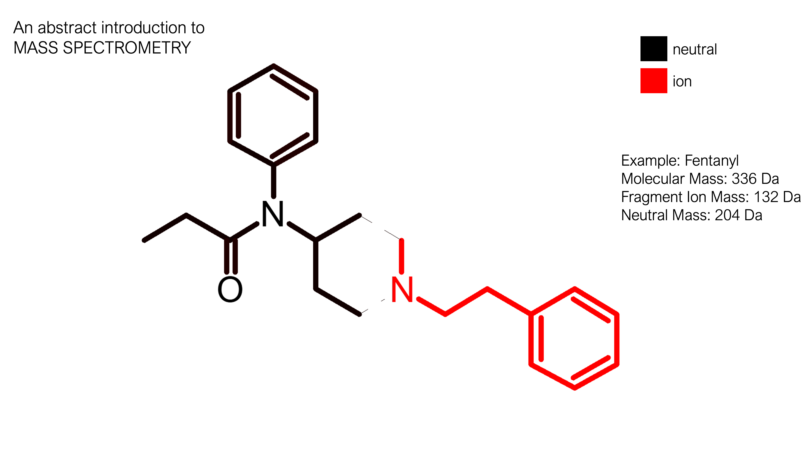{fig-align="center"}

##

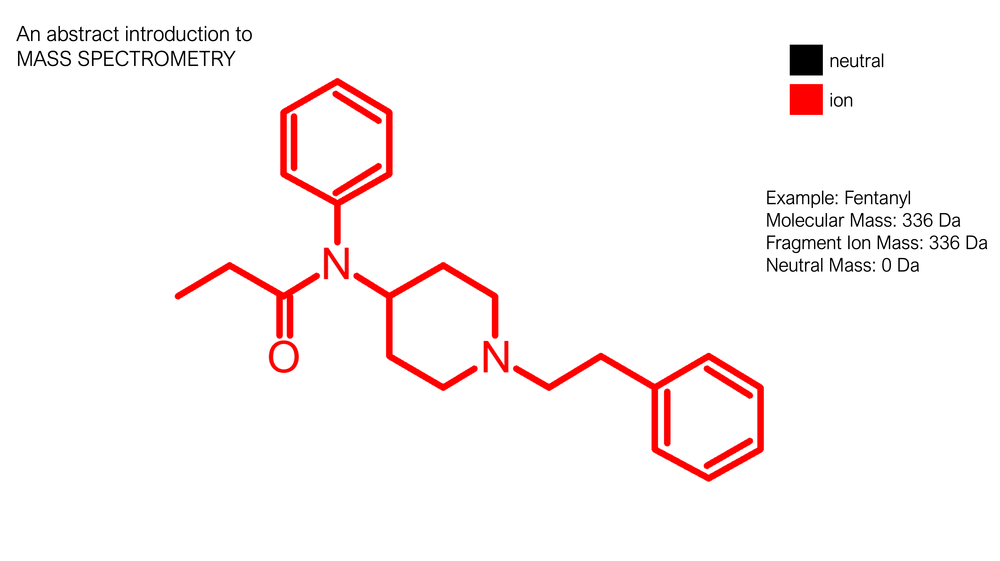{fig-align="center"}

##

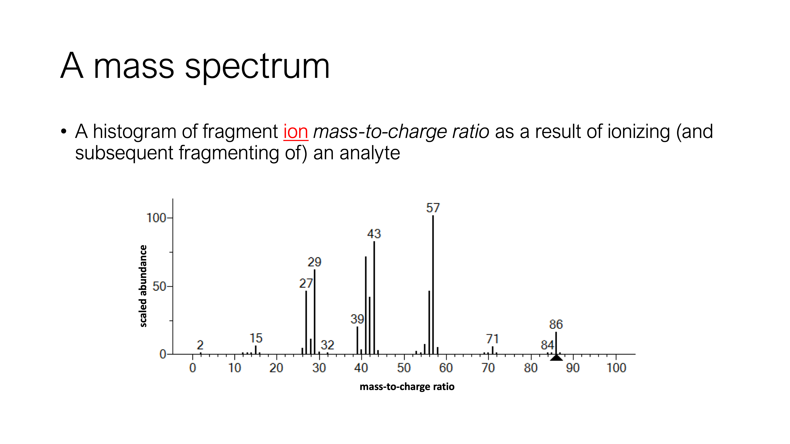{fig-align="center"}

## Ambient ionization mass spectrometry

- Three *main* strategies for ionization at atmospheric pressure: 
  - Ion-molecular reaction
  - Photochemical ionization
  - Charged droplets  

- Three *main* strategies for liberating analytes from sample without extensive sample preparation: 
  - Liquid extractions
  - Thermal/Chemical Desorption (Plasma)
  - Spallation (Laser Ablation)  

## Ambient ionization mass spectrometry

- **Over 30 unique** ambient ionization mass spectrometry techniques described in the scientific literature (with over 30 citations each)  

:::: {.columns .fragment}

:::{.column width="25%"}
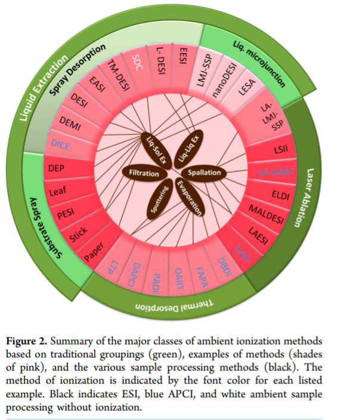{fig-align="center"}

:::

:::{.column width="25%"}
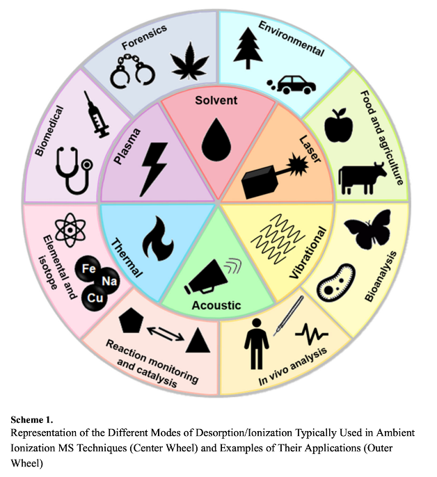{fig-align="center"}

:::

:::{.column width="50%"}
 
LF: from [Venter et al. (2014)](https://doi.org/10.1021/ac4038569){target="_blank"}  
RF: from [Fieder et al. (2019)](https://doi.org/10.1021/acs.analchem.9b00807){target="_blank"}
:::

::::

## Ambient ionization mass spectrometry

[**LIMITATIONS**]{.fragment}

- Desorbed materials can be a complex multi-compound mixture, especially in truly ambient applications
  - Competitive ionization / ion suppression
  - Sensitivity / LOD
  - Less control over operating parameters - more research to be done
  
## Ambient ionization mass spectrometry

[**AVAILABILITY**]{.fragment}

- Many users build custom ambient ionization techniques and use with available (LC) mass spectrometry   

- Many commercial options available:

  - [Bruker (IonSense) DART-MS](https://www.bruker.com/en/products-and-solutions/mass-spectrometry/dart-ms.html){target="_blank"}
  - [Thermofisher VeriSpray](https://www.thermofisher.com/order/catalog/product/VSIS1-10000){target="_blank"}
  - [Waters RADIAN ASAP](https://www.waters.com/nextgen/ca/en/products/mass-spectrometry/mass-spectrometry-systems/radian-asap-direct-mass-detector.html){target="_blank"}
  - [Plasmion SICRIT](https://plasmion.com/technology/){target="_blank"}
  
  
## Ambient ionization mass spectrometry

[**COSTS**]{.fragment}

- Requires purchasing of ambient ionization front end with a mass spectrometer backend
  
  - Can often work with existing (liquid chromatography) mass spectrometry instruments  

- Less sample preparation means *less* training, however the data analysis is more complicated

## Ambient ionization mass spectrometry

- Some useful references include: 
  - [Venter et al. (2014)](https://doi.org/10.1021/ac4038569){target="_blank"}
  - [Fieder et al. (2019)](https://doi.org/10.1021/acs.analchem.9b00807){target="_blank"}
  - [Sisco and Forbes (2021)](https://doi.org/10.1016/j.forc.2020.100294){target="_blank"}
  - [da Silva Ferreira et al. (2014)](https://doi.org/10.1039/c4an01617c){target="_blank"}  
  
- A good [webinar](https://forensiccoe.org/workshop-real-time-mass-spectrometry/){target="_blank"} about DART-MS by the Forensic Technology Center of Excellence (requires creating an account)

:::{.notes}
- venter - mechanisms of AI-MS
- Fieder - review of applications
- sisco - review of forensic applications
- da silva - interesting application to ballpoint pen ink analysis
:::

## Gas Chromatography

- Gas chromatography (GC) is a popular form of chromatography
  - Vapor Phase Chromatography (VPC)
  - Gas Liquid Partition Chromatography  

- Liquid or gas sample is mixed with a non-reactive carrier gas and then passes through a column  

- Compounds separate according to chemical and physical properties

## Gas Chromatography

::::{.columns}

:::{.column width="60%"}
- Can change parameters of GC system (e.g., carrier gas flow rate, oven temperature), which can change how compounds separate  

- Can change column length or lining material, which may change how compounds separate
:::

:::{.column width="40%"}
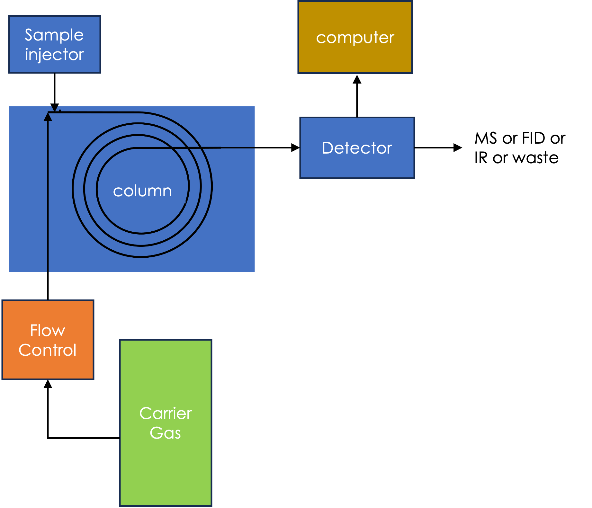{fig-align="center"}
:::
::::

## Gas Chromatography
 

[**CHALLENGE**]{.fragment} 

- Coelution is when two (or more) compounds in the analyte do not “clearly” separate
- Can be a significant issue with complex mixtures with a lot of components at various concentrations

## 

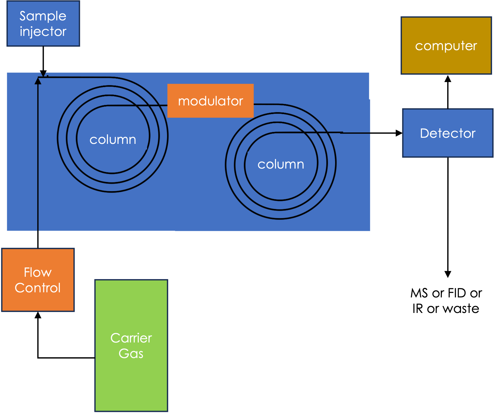{fig-align="center"}

## GC x GC

- Two-dimensional gas chromatography (GC x GC) is a technique where two columns with different material linings are used to further increase separation
  - A modulator is used to concentrate eluent prior to being injected into second column  

- This concept can be extended to “higher dimensions”
  - Scales poorly due to cost (and reproducibility)

## GC x GC

- As of 2018, GC x GC has not met the Daubert criteria  

- The first accredited GC x GC method for analysis of persistent organic pollutants was developed by the Canadian Ministry of the Environment and Climate Change

## GC x GC

- Not used in casework, but lots of research use across forensic disciplines
  - Human scent / taphonomy
  - Arson investigation
  - Drugs, CW, Explosives
  - Environment  

- [Gruber et al. (2018)](https://doi.org/10.1016/j.trac.2018.05.017)

## GC Infrared Spectroscopy

[**HISTORY**]{.fragment}

- Technique first described in the literature in 1964   

- Developed as an alternative to GC-MS which can better discriminate structural isomers   

- Several iterations and modifications on the original GC-IR design over the last 50 years; most prominent system now is GC-FTIR   

## GC Infrared Spectroscopy

:::: {.columns}

:::{.column width="50%}

[**MECHANISMS**]{.fragment}

  - GC is used to separate the sample components 
  - IR Spectroscopy is used to characterize components based on absorption properties

    - Absorption properties tell us about presence/absence of “functional groups”; can be used to infer structure

:::

:::{.column widht="50%"}
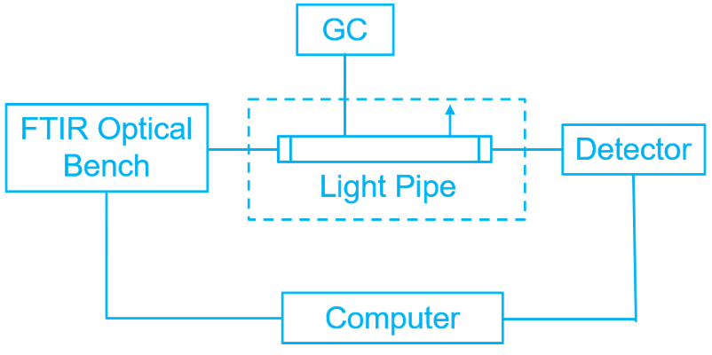{fig-align="center"}
:::

::::

## GC Infrared Spectroscopy

- Similar application areas as GC-MS
  - Environmental Analysis: detecting pollutants in air/water/soil
  - Forensic Science: crime scene chemicals, “chemical fingerprint”
  - Pharmaceutical Analysis: quality control, discovery
  - Food and Flavor Analysis: quality control, discovery

## GC Infrared Spectroscopy

[**LIMITATIONS**]{.fragment}

- Sensitivity (need a lot of sample to get a reasonable signal)
- Sensitivity improves using FTIR
  - 50 years of research have greatly improved sensitivity
  - Isotope analysis

- Lack of generally accepted databases for searching/identification

## GC Infrared Spectroscopy

[**VENDORS**]{.fragment}

- [ThermoFisher](https://www.thermofisher.com/order/catalog/product/IQLAADGAAGFAJAMASY){target="_blank"}

[**COSTS**]{.fragment}

- GC and FTIR system must be compatible 
- GC sample preparation, more sample needed given lower sensitivity
  - Training to interpret IR spectra   

## GC Infrared Spectroscopy

- Some useful references include:
  - [Griffiths et al. (2008)](https://journals.sagepub.com/doi/pdf/10.1366/000370208786049213){target="_blank"}
  - [A description of GC-IR by BOC Sciences solutions](https://www.solutions.bocsci.com/resources/gas-chromatography-infrared-spectroscopy-gc-ir.html){target="_blank"}
  - [A description of GC-IR by Chromatoraphy Today (trade magazine)](https://www.chromatographytoday.com/news/gc-mdgc/32/breaking-news/how-is-gc-ir-used/57181){target="_blank"}

- [A great public lecture on GC-IR](https://www.youtube.com/watch?v=gBJccqXDh4g){target="_blank"} 

- [A great resource (LibreText) for learning about infrared spectroscopy and mass spectrometry](https://chem.libretexts.org/Bookshelves/Organic_Chemistry/Map%3A_Organic_Chemistry_(Wade)_Complete_and_Semesters_I_and_II/Map%3A_Organic_Chemistry_(Wade)/11%3A_Infrared_Spectroscopy_and_Mass_Spectrometry){target="_blank"}

:::{.notes}
- griffiths covers a lot of the history and future of GC-IR
::::

## GC Infrared Spectroscopy

[**Recent Research**]{.fragment}

- [Kranenburg et al. (2021), Forensic Chemistry](https://doi.org/10.1016/j.forc.2021.100346){target="_blank"}

- [Salerno et al.(2020), Frontiers in Chemistry](https://doi.org/10.3389/fchem.2020.00624){target="_blank"}

- [Ferguson et al. (2023),  Journal of Forensic Science](https://doi.org/10.1111/1556-4029.15306){target="_blank"}

:::{.notes}
-kranenburg - trends in commercial mixtures

- salerno - proof of concept study

- ferguson - interlaboratory study
:::

## Miniaturization and Portable Techniques

::::{.columns .fragment}

:::{.column width="60%"}
- Spectrometers have decreased in size over the past 20 years
  - optical spectrometers
  - mass spectrometers
  - nuclear magnetic resonance (NMR) spectrometers  

- Trending towards smaller and more rugged instrumentation, enabling portable analysis
:::

:::{.column width="30%"}
 
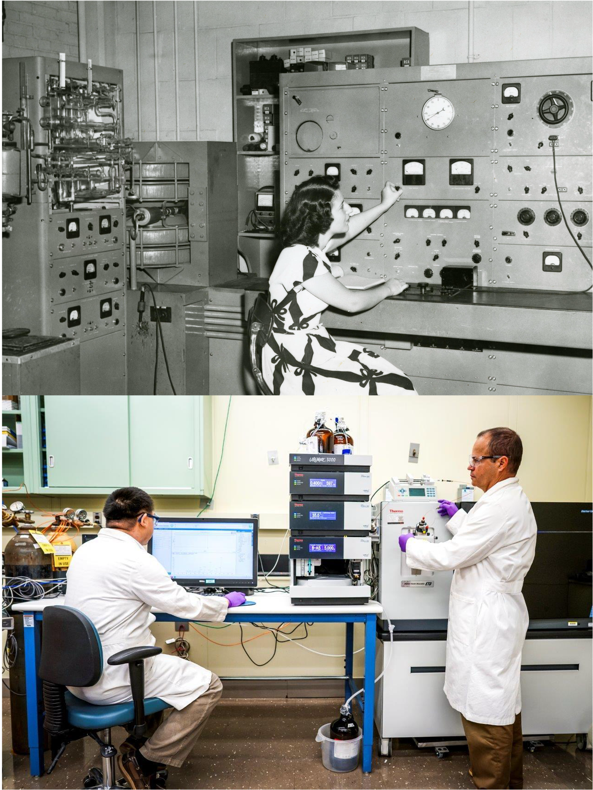{fig-align="center"}
:::

::::

## Miniaturization and Portable Techniques

## Miniaturization and Portable Techniques

- **Ion Mobility Spectroscopy (IMS)**
  - Illicit drugs; explosives
  - Pros: low LOD; simple to operate; no sample preparation
  - Cons: presumptive ID (high FPR); destructive; potential to overload detector; long start-up time   

- **Fourier Transform Inferred Spectroscopy (FT-IR)**
  - Breath alcohol; illicit drugs; counterfeit drugs; explosives
  - Pros: non-destructive; highly selective; simple to operate; no consumables
  - Cons: high LOD; mixtures 

## Miniaturization and Portable Techniques

- **Raman Spectroscopy **
  - Illicit drugs; explosives; counterfeit drugs
  - Pros: non-destructive, highly selective; no contact required; simple to use
  - Cons: high LOD; mixtures; fluorescence (interference)   

- **Gas Chromatography Mass Spectrometry (GC-MS)**
  - Illicit drugs; counterfeit drugs; explosives; ignitable liquids
  - Pros: high selectivity; low LOD; mixtures; standards/libraries
  - Cons: destructive; high cost; isomers

## Miniaturization and Portable Techniques

- **Mass Spectrometry (MS)**
  - Illicit drugs; explosives
  - Pros: high selectivity; low LOD
  - Cons: destructive; high cost; mixtures; isomers  

- **High Pressure Mass Spectrometry (HP-MS)**
  - Illicit drugs; explosives
  - Pros: low LOD; size
  - Cons: presumptive ID (high FPR); incomparable to traditional mass spectral data

## Miniaturization and Portable Techniques

- As of 2021, most portable techniques have not been generally adopted in crime investigation
  - Perceived costs and complexity
  - Lack of training / hesitancy to learn new techniques / too big a change  

- [Crocombe et al. (eds) Portable Spectroscopy and Spectrometry Volumes 1 and 2, 2021.](https://onlinelibrary.wiley.com/doi/book/10.1002/9781119636489){target="_blank"} 
  - Can review (and download) entire book with your Trent University log in

##
   
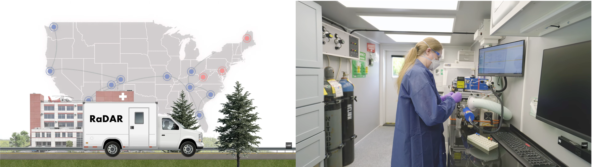{fig-align="center"}

## Coming up
- Seminars are running in-person on Thursday October 1st (F01 and F02) 
 
- Lecture next week: Emerging applications of chemistry in forensic science