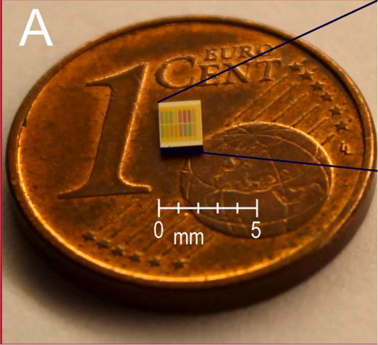

## Answers to objective questions

1. Citation: 
[Kranenburg RF, Ou F, Sevo P, Petruzzella M, De Riddier R, Van Klinken A, et al. On-site illicit-drug detection with an integrated near-infrared spectral sensor: A proof of concent. Talanta. 2022;245:123441.](https://doi.org/10.1016/j.forc.2021.100382){target="_blank"}  

2. Journal: Talanta  

3. \# printed pages: 8 printed pages  

4. Lead Author: Ruben Kranenburg

## Answers to objective questions

5. Corresponding Author: Ruben Kranenburg  

6. Affiliation: Dutch National Police and University of Amsterdam  

7. Contact Info: ruben.kranenburg@politie.nl  

8. \# institutions involved with **writing** the article: 5  

## Answers to objective questions

9. Main Headings/Sections: 
*Title/Author information*, Abstract, Introduction, Materials and Methods, Results and Discussion, Conclusion, *Author contributions*, *Declaration of Competing Interests*, *Acknowledgements*, *Supplementary Data*, and References  

10. \# of figures/tables: 6  

11. \# of references: 55  

12. \# of intro paragraphs: 6  

## Answers to objective questions (September 26, 2026)

17. According to google scholar, how many citations: 68  

18. Most recent article: 
[Verhoeven MCM, Huls RC, van der Stelt N, de Koning JC, van Grol M, et al.Effect of reaction time and termperature on the impurity profile of amphetamine in the Leuckart Method. Drug Testing and Analysis 18, 6 (2026).](https://doi.org/10.1002/dta.70063){target="_blank"}

## 

:::: {.columns}
::: {.column width="60%" }
**Arun's quick reflection**:
  
  - The technology appears impressive 
  - The conclusions are ... Bold?
  - Some experimental design choices limit the applicability of the findings
  - Clear methods, transparent interpretation; good for a **proof-of-concept study**
  - Cool to see collaboration between research institute and law enforcement
:::

::: {.column width="40%"}
 
{fig-align="center"}
:::

::::
